aA

  

<h1 align="center">jLibrary</h1>
<h3 align="center">Sistema de gestão de bibliotecas</h3>
<h4 align="center"><a href="TCC.pdf">TCC</a> | <a href="TCC_slides.pdf">SLIDES</a> | <a href="compiled_program.zip">PROGRAMA</a></h4>

---

## Ferramentas utilizadas

  
  

## Estrutura do Banco de Dados

  <a href="imgs/banco.png">
    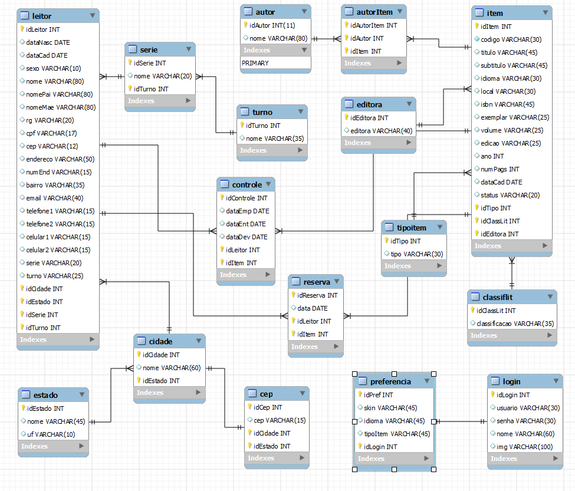
  </a>

## Interface Gráfica

### Carregamento do sistema

  

### Autenticação

  <a href="imgs/p3.png">
    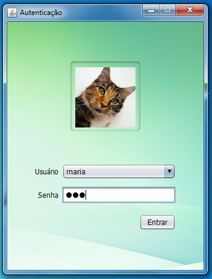
  </a>

### Tela principal

  <a href="imgs/p11.png">
    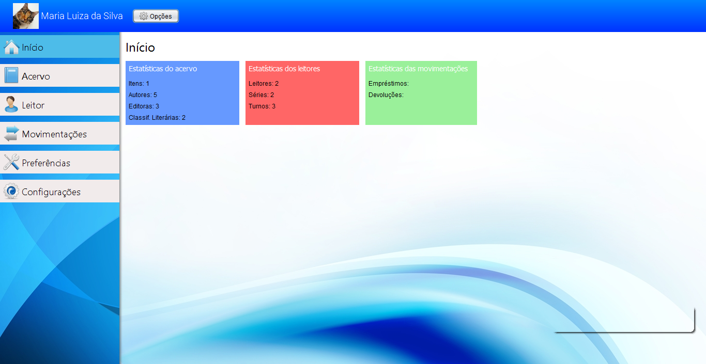
  </a>

### Cadastro de itens

  <a href="imgs/p2.png">
    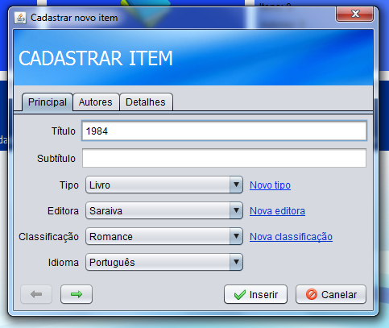
  </a>

### Gerenciador de acervo

  

### Cadastro de leitores

  <a href="imgs/p6.png">
    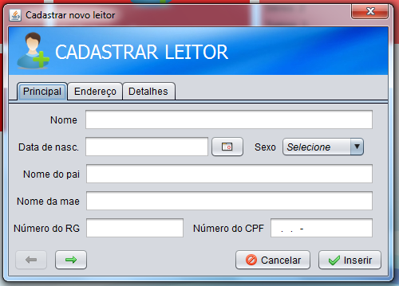
  </a>

### Gerenciador de leitores

  <a href="imgs/p5.png">
    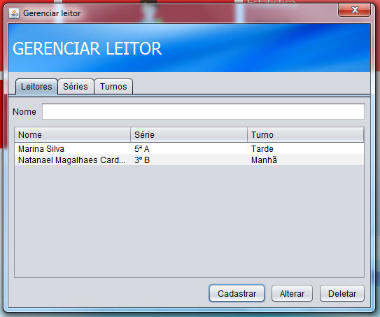
  </a>

### Empréstimo de itens

  <a href="imgs/p10.png">
    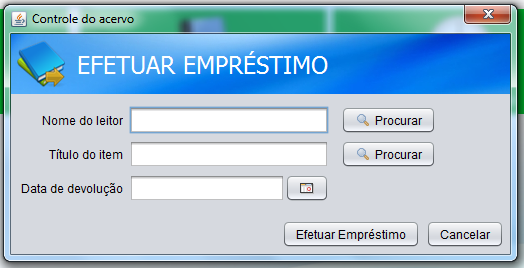
  </a>

### Devolução de itens

  <a href="imgs/p9.png">
    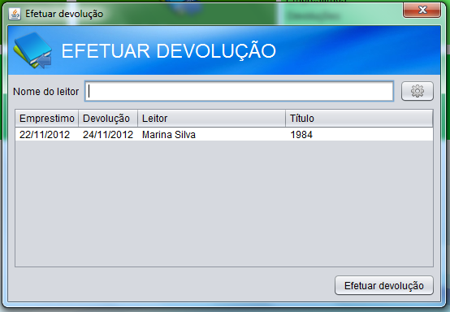
  </a>

### Gerador de relatórios

  <a href="imgs/rel.png">
    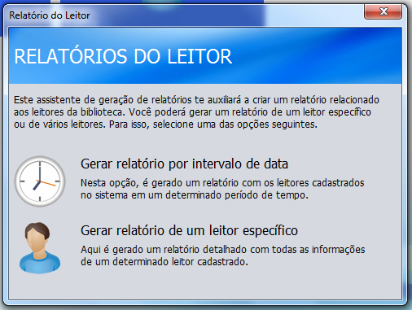
  </a>

  <a href="imgs/relatorio12.png">
    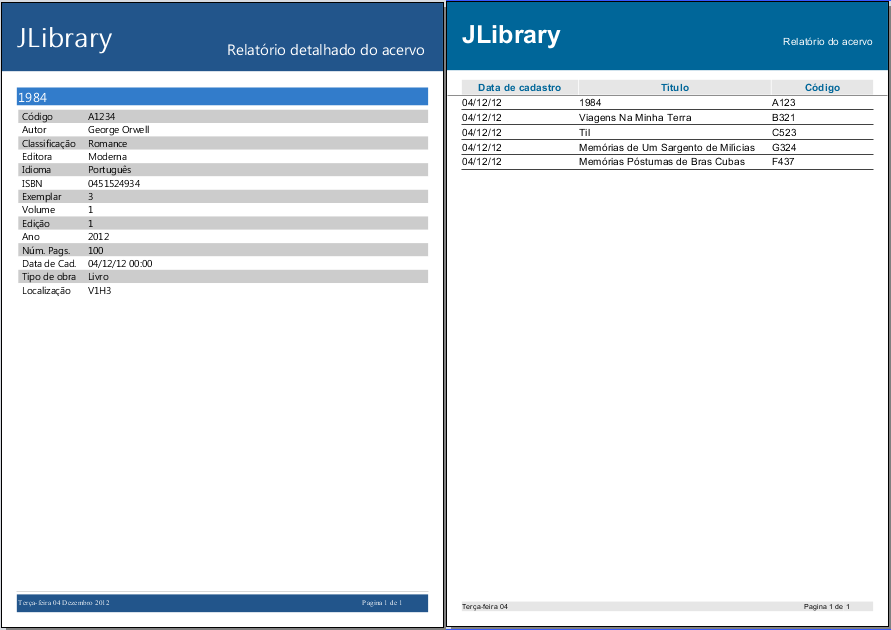
  </a>

### Configuração do banco de dados

  <a href="imgs/p7.png">
    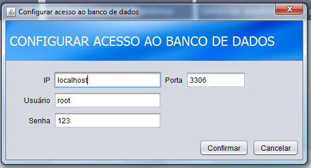
  </a>

### Otimização do preenchimento de formulários

  <a href="imgs/p8.png">
    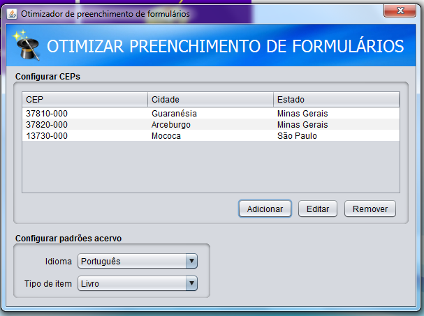
  </a>

